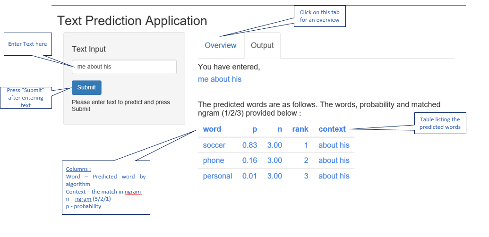

```{r setup, include=FALSE}
knitr::opts_chunk$set(echo = FALSE)
```

# Overview

This presentation has been prepared as part of the Capstone project submission of Coursera Data Science. The assignment was to build a prediction algorithm and create a product which leverages the same to predict the next word.    

The assignment consists of the below two deliverables :     

- (A) Shiny App which takes text as input and predicts the next word    
- (B) Presentation of 5 slides (using R Studio Presenter) covering algorithm and how to use the app          
This presentation addresses deliverable (B).         

# Prediction Model & Algorithm   

##Model   
- 10% sample of Data set provided as part of course (SwiftKey) used to prepare the model   
- Data across blog, news and twitter types pre processed (remove numbers, punctuation, non english etc.)    
- Ngram models (uni, bi & tri) prepared using R packages which provides the tokens (sequence of words) and frequency        
- Prepare model from NGram with the following :  
     -  context (token without last word - would be matched with the input text)    
     -  word (last word of the token - would be returned as predicted word)    
     -  ngram (1/2/3 to indicate uni, bi or tri gram)    
     -  probability (using  back off)    

##Algorithm     
- Pre-process input string using same steps as in model preparation    
- Match starting with NGram = 3 and go down to 1. Limit to 3 entries with highest probability        
    - NGram = 3 : last two words from input text ==  context, sort by probability    
    - NGram = 2 : last  word from input text == context, sort by probability    
    - NGram = 1 : pick top 3 words (context is NULL), sorted by probability        
- Return the list of word matched by above logic. Maximum of 3 entries would only be shown   

# Shiny App    
The shiny app UI and usage detailed below :     


ShinyApp available at <http://rstudio.com>    


# Points noted  

- RWeka tokeniser - out of memory Java heapsize issue. Generating uni, bi and tri ngrams seperately and merging them to prepare final model    
- Model generation was done using RWeka, TDM and ngram. Considerable improvement in performance was observed by moving to the final model using ngram.     
- Other optimization suggested for performance improvement around using list, data frame, sapply etc were also implemented    

For details lookup the versions of the NGram function included in git        


# References       

- SwiftKey data set shared as part of the course receivables    
- Script repository <https://github.com/vinodneth/CStone>     
- Shiny App available at <https:// >    

